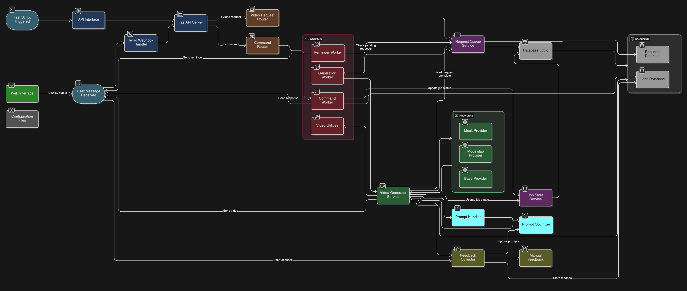
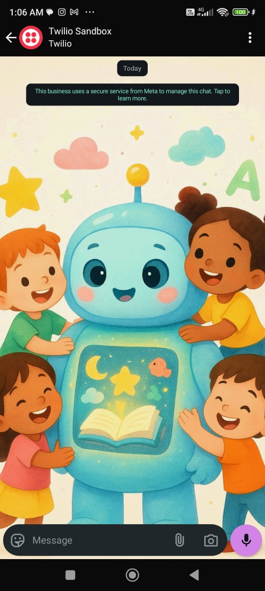
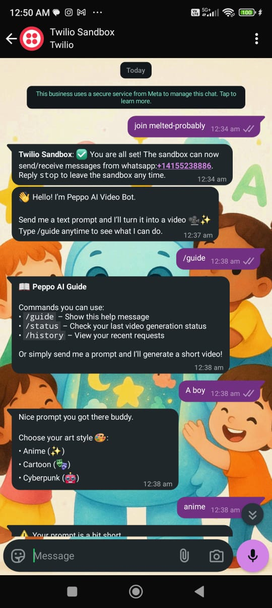
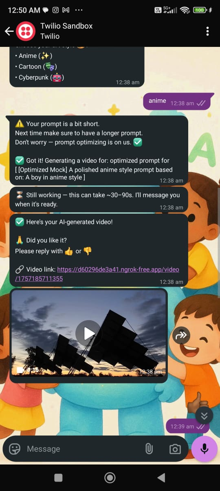
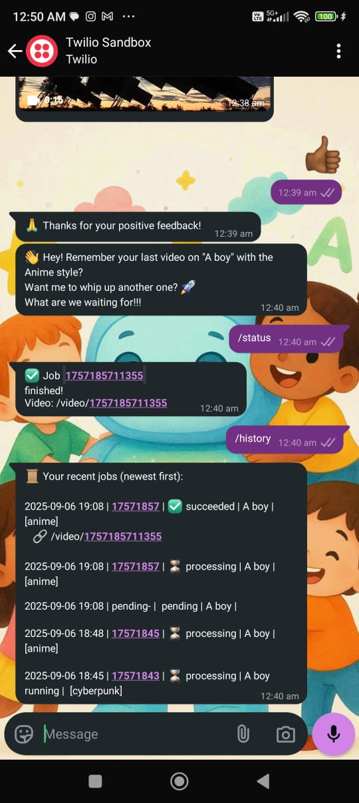
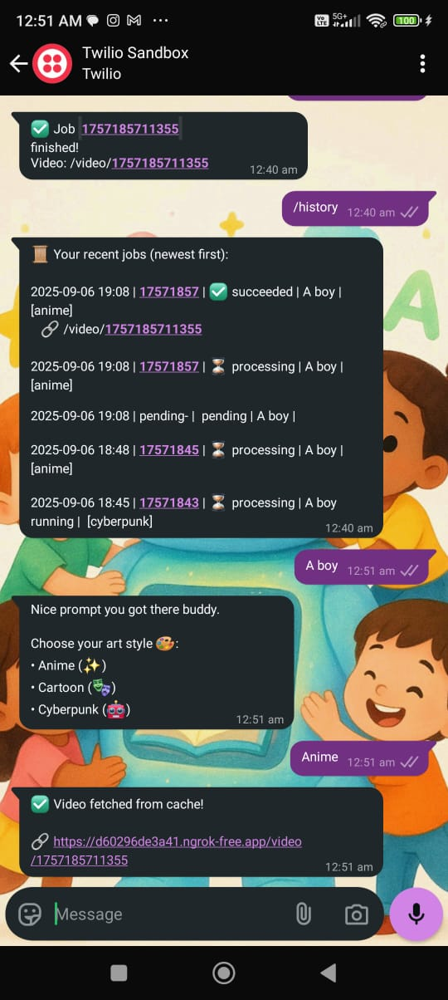
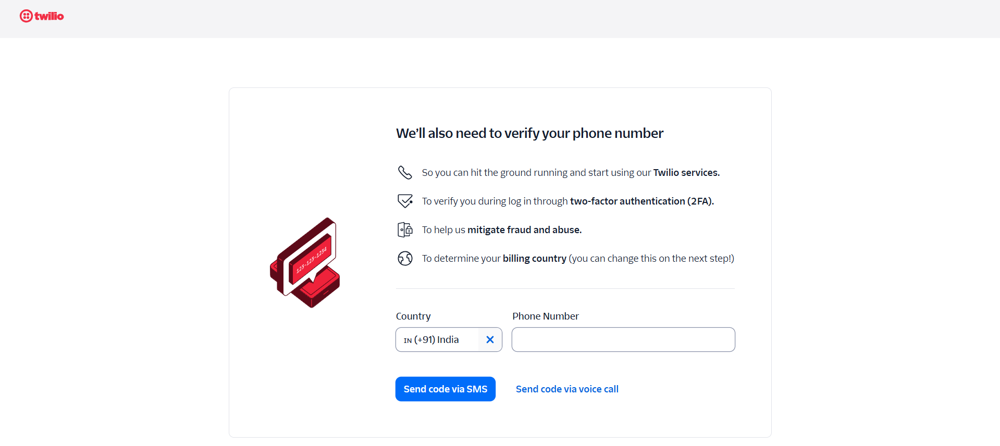
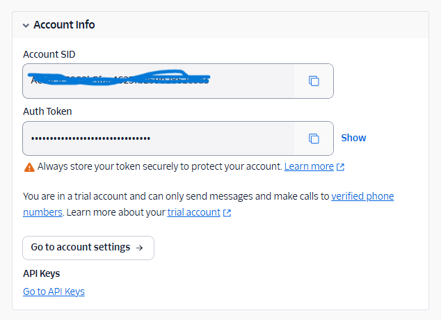
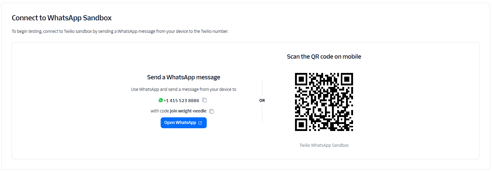
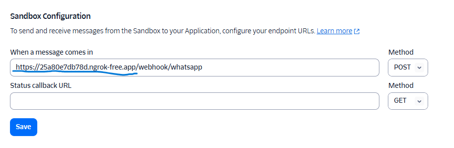

# 🎥 Peppo – AI-Powered Text to Video Generator Whatsapp Bot Integration

Round 2 Technical Challenge: A simple, provider-agnostic web app that helps generate **videos** from **text ideas** and **optimized prompts** using AI which is integrated into a **Whatsapp Bot** using **Twilio**  

- ⚡ **FastAPI** backend
- 🌐 **Twilio** integration framework
- ✨ **Creative idea generation** and **prompt optimization**  
- 🗂️ Clear project structure with providers & services  
- 🔑 **API key configurable** via `.env.example` (for api key configuration reference)  
- 🌍 Accessible via twilio whatsapp sandbox  

---

## ✨ Features  

- 👋 **Warm Welcome**: The bot sends an **introductory message** on startup to avoid cold starts for new (and especially kid) users.  
- ⌨️ **Kid-Friendly Commands**: Simple and easy command lines designed for children to **learn & explore** without confusion.  
- 💬 **Conversational Flow**: An interactive, chat-like mechanism that makes generating videos feel like talking to a friend.  
- 🧑‍🏫 **Friendly Prompt Optimizer**: Gently guides kids to improve their prompts while ensuring video quality stays top-notch.  
- 🔔 **Periodic Notifications**: Timely reminders encourage kids to **come back daily**, boosting engagement & retention.  
- ❤️ **Simple Feedback Loop**: Kids can share opinions 👍👎 easily, and their feedback gets fed back into improvements.  
- 🎬 **WhatsApp-Ready Videos**: Automatic **video compression with FFmpeg** keeps files under WhatsApp’s 16 MB limit.  
- ⚡ **Smart Performance**: Built-in **queueing, cache retrieval, and error handling** ensure a smooth, lag-free experience.  

---

## 📂 Project Structure

```bash
.
|   .env.example            # Sample API Key and other configurations
|   jobs.db                 # Video ID records database
|   requests.db             # User requests queue database
|   
+---api/                    # API endpoint
|       
+---app/                    # Core application logic
|   |   
|   +---integrations/       # Twilio integration endpoint
|   |           
|   +---providers/          # External provider integrations 
|   |           
|   +---services/           # Business logic and services
|   |           
|   +---static/             # Static files
|   |   |   
|   |   \---compressed/     # Compressed file from ffmpeg operation   
|   |           
|   +---templates/          # HTML templates
|   |       
|   +---workers/            # Whatsapp bot actions endpoints
|           
\---scripts/                # Operation scripts
```

---

## 🧭 Application Workflow

> **Workflow Diagram**
>
> 

---

## 🌐 Demo Video:

👉 Live App URL: [https://peppo-video-app-new.vercel.app/](https://peppo-video-app-new.vercel.app/)

---

## 📲 Phone Demo Screenshots  

<p align="center">
  
  
</p>

<p align="center">
  
  
</p>

<p align="center">
  
</p>

---

## 🌐 Demo Website:

👉 Live App URL: [https://peppo-video-app-new.vercel.app/](https://peppo-video-app-new.vercel.app/)

---

## ⚓ Twilio Account SetUp

> **Guidelines**
>
> 
>
> 
>
> 
>
> 

---
